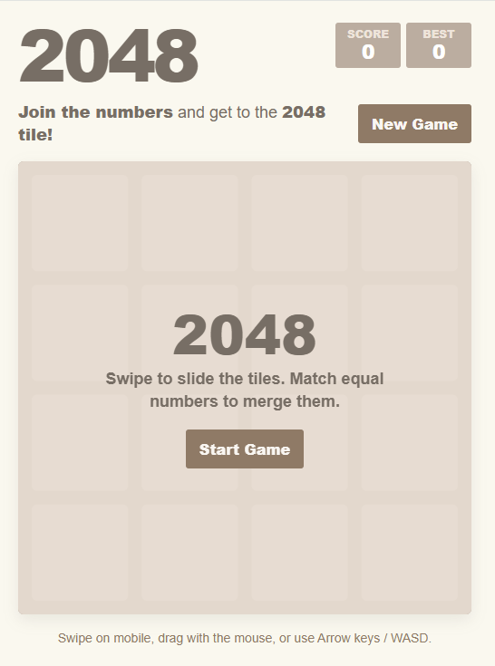

# 2048

<p align="center">
  
</p>

A mobile-friendly clone of the classic [2048](https://en.wikipedia.org/wiki/2048_(video_game)) sliding-tile puzzle game. Slide numbered tiles on a 4x4 grid; matching tiles merge into one whose value is the sum. Reach the **2048** tile to win — keep going to chase a higher score.

**Play it now:** [https://tcottrill.github.io/my2048/](https://tcottrill.github.io/my2048/)

The whole game is a single self-contained `index.html` — no build step, no server, no dependencies. It is also a Progressive Web App (PWA), so you can pin it to your iPhone or Android home screen and play it like a native app, full-screen and offline-friendly.

## Free and open

This project is released into the **public domain** under the [Unlicense](LICENSE). It is **100% free**:

- No purchase, subscription, or in-app payment.
- No ads, no trackers, no analytics.
- No account or sign-in.
- No network calls — once the page is loaded, the game runs entirely on your device.

You may copy, modify, redistribute, or sell it for any purpose.

## How to play

- **Touch:** swipe up, down, left, or right on the board.
- **Keyboard:** arrow keys (or WASD).
- Tiles with the same number merge when they collide. Each merge adds the combined value to your score.
- The game ends when the board is full and no moves remain.

## Install on your iPhone (pin to home screen)

Because it is a PWA, you can add the game to your home screen and launch it like any other app — full-screen, no Safari address bar.

1. On your iPhone, open **Safari** (this only works in Safari — not Chrome or Firefox on iOS) and navigate to [https://tcottrill.github.io/my2048/](https://tcottrill.github.io/my2048/).
2. Tap the **Share** button (the square with the up arrow) at the bottom of the screen.
3. Scroll down and tap **Add to Home Screen**.
4. Confirm the name (it will default to "2048") and tap **Add** in the top-right.

A "2048" icon now appears on your home screen. Tap it to launch the game full-screen — it will look and feel like a native app, with no browser chrome.

### Notes (iPhone)

- iOS requires the page be loaded over **HTTPS** for the home-screen app to launch in standalone mode. The GitHub Pages URL above is HTTPS, so it works out of the box.
- The icon and splash background use the `apple-touch-icon.png` and theme color already configured in `index.html` and `site.webmanifest`.
- To remove the app, long-press the icon on the home screen and choose **Remove App → Delete Bookmark**.

## Install on your Android phone (pin to home screen)

Yes — Android supports the same PWA install flow, and on Android it produces an even more app-like result: the game installs through the system's WebAPK mechanism, gets its own entry in the app drawer, and runs in its own window without any browser UI.

### Chrome (recommended)

1. Open **Chrome** on your Android phone and go to [https://tcottrill.github.io/my2048/](https://tcottrill.github.io/my2048/).
2. You may see an "Install app" or "Add to Home screen" prompt at the bottom of the screen — tap it and confirm.
3. If no prompt appears, tap the **⋮** (three-dot menu) in the top-right, then choose **Install app** (or **Add to Home screen** on older versions of Chrome).
4. Confirm the name and tap **Install** / **Add**.

A "2048" icon will appear on your home screen and in your app drawer. Tap it to launch the game full-screen.

### Other Android browsers

- **Samsung Internet:** menu → **Add page to** → **Home screen**.
- **Firefox:** menu → **Install** (or **Add to Home screen**), depending on version.
- **Edge:** menu → **Add to phone**.

### Notes (Android)

- To uninstall, long-press the icon and tap **Uninstall** (or drag it to the **Uninstall** target at the top of the screen) — same as any other app.
- Because Android installs it as a WebAPK, the game will also appear under **Settings → Apps**.

## Run locally

Open `index.html` directly in any modern browser. That's it.

To test the PWA install flow on desktop, serve the folder over HTTP — for example:

```sh
# Python 3
python -m http.server 8000
```

Then visit `http://localhost:8000` in your browser.

## Files

- `index.html` — the entire game (HTML, CSS, JavaScript).
- `site.webmanifest` — PWA manifest (name, icons, theme color).
- `apple-touch-icon.png`, `icon-192.png`, `icon-512.png`, `favicon-*.png` — app and tab icons.
- `LICENSE` — public domain dedication.

## License

[Unlicense](LICENSE) — public domain.
